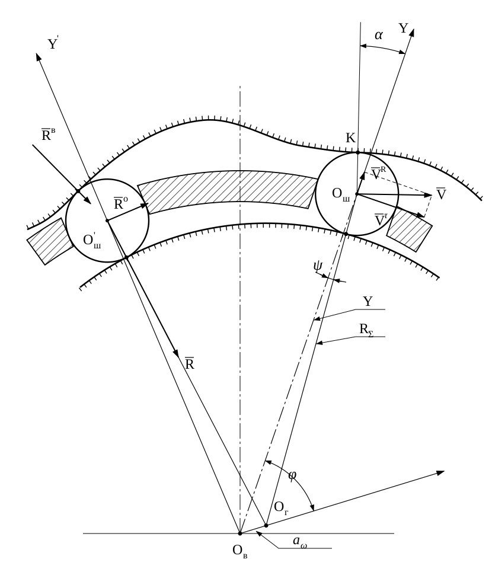
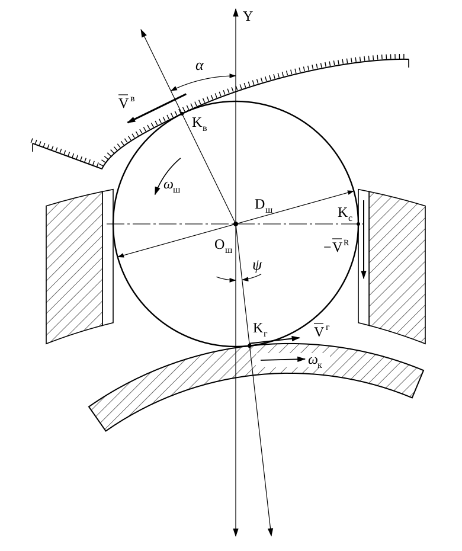

# Силовой расчёт волновых передач с промежуточными телами качения с адаптивным генератором

**Автор:** В.С. Янгулов, Томский политехнический университет
**Источник:** Известия Томского политехнического университета. 2008. Т. 312. № 2. С. 28–31. УДК 621.833

**Аннотация.** Представлены методики расчётов: усилий в контактах промежуточных тел качения волновых передач с упругим натягом в зацеплении; относительных скоростей в контакте деталей передачи; мощности потерь на трение в зацеплении.

> **О документе.** Конвертация статьи в Markdown для использования в качестве контекста ИИ. Рисунки перерисованы в SVG и снабжены текстовыми описаниями. Опечатки оригинала исправлены, недостающие выкладки реконструированы; все такие места отмечены метками [О1]…[О15] и перечислены в разделе «Отличия от оригинала статьи».

## Обозначения и соглашения о знаках

Углы $\varphi$, $\tilde\varphi$, $\theta$, $\gamma$, $\psi$ отсчитываются от оси $Y$ рассматриваемого шарика (линии $O_\text{в}O_\text{ш}$) по часовой стрелке (рис. 2). Генератор вращается против часовой стрелки (рис. 1); $\omega > 0$ — модуль угловой скорости входного звена, поэтому $\dot\varphi = -\omega$ [О4]. Рабочий ход шарика (выдвижение из центра, $V^R > 0$) соответствует $0 < \varphi < \pi$.

Индексы контактов: «г» — генератор, «о» — обойма (на рис. 4 точка подписана $K_\text{с}$), «в» — зубчатый венец жёсткого колеса. Положительные направления вращения — как на рис. 4: $\omega_\text{ш}$ — против часовой стрелки, $\omega_\text{к}$ (наружное кольцо генератора, абсолютная) — по часовой стрелке. Скорости в формулах — алгебраические проекции на направления, показанные на рис. 4; на рисунках векторы обозначены чертой ($\bar V$, $\bar R$). В уравнениях равновесия (5), (7) реакции записаны как $\vec R_i$, в проекциях используется их модуль $R_i$.

Для краткости при номинальном положении ($\tilde a_\omega = a_\omega$, $\tilde\varphi = \varphi$) введено обозначение

$$
S = \sqrt{R_\Sigma^2 - a_\omega^2\sin^2\varphi} = R_\Sigma\cos\psi .

$$

## Введение

Высокие требования к редукторным приводам, применяемым в космической технике, определяют жёсткие значения характеристик передач, входящих в состав редукторов. Одним из наиболее перспективных видов передач для обеспечения задаваемых характеристик являются волновые передачи с промежуточными телами качения (ВППТК).

Точность передачи управляющих перемещений от двигателя к управляемому объекту — наиболее важная характеристика привода, включая и редуктор. Мёртвый ход кинематической цепи редуктора во многом влияет на эту характеристику, а он, в свою очередь, зависит от зазоров в зацеплении. Работоспособность приборных редукторов прежде всего определяется изменением точности передачи управляющих перемещений и выходом её за заданные пределы. Увеличение зазоров происходит за счёт износа рабочих поверхностей. Использование деталей с твёрдостью рабочих поверхностей более 60 HRC позволяет существенно уменьшить износ.

Создание ВППТК с упругим натягом в зонах контакта тел качения (далее — шарики) с поверхностями генератора, обоймы и зубьями жёсткого колеса за счёт самоустановки генератора под действием упругих элементов [1–4] позволяет решить задачу повышения точности. Это достигается устранением зазоров в зацеплении на начальном этапе эксплуатации и компенсацией их увеличения вследствие износа.

Силовой расчёт передач с жёстко фиксированным на опорах генератором: при $N$ шариках в зацеплении система $N-1$ раз статически неопределима; кроме уравнений равновесия требуются $N-1$ уравнений совместности. В инженерных расчётах используют зависимости с эмпирическими коэффициентами [5].

Передача с адаптивным генератором статически определима, так как генератор опирается на три точки: нужны уравнение моментов и два уравнения сил.

## Самоустановка генератора

## fig1.svg

```svg
<svg xmlns="http://www.w3.org/2000/svg" viewBox="0 0 570 600" width="570" height="600"
     font-family="Times New Roman, serif" font-size="20">
  <title>Рис. 1. Самоустановка генератора в ВППТК</title>
  <desc>Сплошная линия — генератор опирается на три шарика (центр Oг);
        штриховая — на два шарика и опору генератора (центр O'г).
        Oв — центр зубчатого венца жёсткого колеса, ℓ — смещение центра генератора.</desc>

  <defs>
    <marker id="arr" viewBox="0 0 10 10" refX="9" refY="5" markerWidth="9" markerHeight="9"
            orient="auto-start-reverse" markerUnits="userSpaceOnUse">
      <path d="M0,1 L10,5 L0,9 z" fill="#000"/>
    </marker>
    <marker id="arrS" viewBox="0 0 10 10" refX="9" refY="5" markerWidth="12" markerHeight="12"
            orient="auto" markerUnits="userSpaceOnUse">
      <path d="M0,1 L10,5 L0,9 z" fill="#000"/>
    </marker>
  </defs>

  <!-- ===== Осевые линии ===== -->
  <g stroke="#000" stroke-width="0.8" fill="none">
    <!-- через Oв -->
    <line x1="275" y1="95"  x2="275" y2="470" stroke-dasharray="22 4 3 4"/>
    <line x1="110" y1="262" x2="470" y2="262" stroke-dasharray="22 4 3 4"/>
    <!-- через O'г -->
    <line x1="318" y1="40"  x2="318" y2="440"/>
    <line x1="60"  y1="248" x2="545" y2="248" stroke-dasharray="22 6"/>
    <!-- через Oг -->
    <line x1="135" y1="305" x2="420" y2="305"/>
    <line x1="262" y1="40"  x2="262" y2="250"/>
  </g>

  <!-- ===== Втулка (неподвижна, центр Oв) ===== -->
  <circle cx="275" cy="262" r="140" fill="none" stroke="#000" stroke-width="2.6"/>

  <!-- ===== Генератор: положение 1 (сплошная, центр Oг) ===== -->
  <circle cx="277" cy="305" r="186" fill="none" stroke="#000" stroke-width="2.6"/>

  <!-- ===== Генератор: положение 2 (штриховая, центр O'г) ===== -->
  <circle cx="318" cy="248" r="190" fill="none" stroke="#000" stroke-width="2.2"
          stroke-dasharray="18 7"/>

  <!-- ===== Шарики, положение 1 (сплошные) ===== -->
  <g fill="none" stroke="#000" stroke-width="2.2">
    <circle cx="84"  cy="180" r="44"/>   <!-- шарик 3 -->
    <circle cx="465" cy="438" r="44"/>   <!-- шарик 1 -->
    <circle cx="229" cy="530" r="44"/>   <!-- шарик 2 -->
  </g>

  <!-- ===== Шарики, положение 2 (штриховые) ===== -->
  <g fill="none" stroke="#000" stroke-width="1.8" stroke-dasharray="8 5">
    <circle cx="179" cy="60"  r="44"/>   <!-- шарик 1' -->
    <circle cx="376" cy="475" r="44"/>   <!-- шарик 2' -->
  </g>

  <!-- метки центров шариков -->
  <g stroke="#000" stroke-width="1.5">
    <line x1="78" y1="172" x2="90" y2="188"/>
    <line x1="458" y1="444" x2="472" y2="432"/>
    <line x1="221" y1="532" x2="237" y2="528"/>
    <line x1="171" y1="66" x2="187" y2="54"/>
    <line x1="369" y1="480" x2="383" y2="470"/>
  </g>

  <!-- ===== Реакции, положение 1 ===== -->
  <g stroke="#000" stroke-width="1.6" fill="none">
    <!-- R3 -->
    <line x1="17" y1="136" x2="171" y2="237" marker-end="url(#arrS)"/>
    <!-- R1 -->
    <line x1="465" y1="438" x2="380" y2="377" marker-end="url(#arrS)"/>
    <!-- R2 -->
    <line x1="229" y1="530" x2="249" y2="433" marker-end="url(#arrS)"/>
  </g>

  <!-- ===== Реакции, положение 2 (штриховые) ===== -->
  <g stroke="#000" stroke-width="1.6" fill="none" stroke-dasharray="9 5">
    <!-- R'1 -->
    <line x1="179" y1="60" x2="264" y2="176" marker-end="url(#arrS)"/>
    <!-- R'2 -->
    <line x1="376" y1="475" x2="351" y2="379" marker-end="url(#arrS)"/>
  </g>

  <!-- ===== R0 — нагрузка на подшипники генератора ===== -->
  <line x1="277" y1="305" x2="84" y2="400" stroke="#000" stroke-width="1.4"
        stroke-dasharray="14 4 3 4" marker-end="url(#arrS)"/>
  <circle cx="163" cy="361" r="3.5" fill="#000"/>

  <!-- ===== Направление вращения ===== -->
  <g stroke="#000" stroke-width="2.6" fill="none">
    <path d="M116,212 A186,186 0 0 0 102,241" marker-end="url(#arrS)"/>
    <path d="M227,394 A140,140 0 0 0 251,400" marker-end="url(#arrS)"/>
  </g>

  <!-- ===== Центры и смещение ℓ ===== -->
  <g stroke="#000" stroke-width="1.4">
    <line x1="275" y1="262" x2="318" y2="248"/>   <!-- Oв–O'г -->
    <line x1="275" y1="262" x2="277" y2="305"/>   <!-- Oв–Oг  -->
  </g>
  <g fill="#000">
    <circle cx="275" cy="262" r="3.5"/>
    <circle cx="318" cy="248" r="3.5"/>
    <circle cx="277" cy="305" r="3.5"/>
  </g>
  <g stroke="#000" stroke-width="1.2" fill="none">
    <line x1="340" y1="280" x2="298" y2="256" marker-end="url(#arr)"/>
    <line x1="345" y1="296" x2="278" y2="296" marker-end="url(#arr)"/>
  </g>

  <!-- ===== Подписи (без tspan/dy, индексы — отдельные элементы) ===== -->
  <g fill="#000" font-family="Times New Roman, Liberation Serif, DejaVu Serif, serif">
    <!-- Oв -->
    <text x="235" y="256" font-size="20">O</text>
    <text x="250" y="262" font-size="14">в</text>
    <!-- O'г -->
    <text x="322" y="238" font-size="20">O</text>
    <text x="337" y="229" font-size="14">'</text>
    <text x="337" y="244" font-size="14">г</text>
    <!-- Oг -->
    <text x="243" y="338" font-size="20">O</text>
    <text x="258" y="344" font-size="14">г</text>
    <!-- ℓ -->
    <text x="340" y="292" font-size="20" font-style="italic">ℓ</text>

    <!-- R3 -->
    <text x="160" y="218" font-size="20">R</text>
    <text x="174" y="224" font-size="14">3</text>
    <!-- R1 -->
    <text x="395" y="352" font-size="20">R</text>
    <text x="409" y="358" font-size="14">1</text>
    <!-- R2 -->
    <text x="258" y="470" font-size="20">R</text>
    <text x="272" y="476" font-size="14">2</text>
    <!-- R'1 -->
    <text x="282" y="190" font-size="20">R</text>
    <text x="296" y="181" font-size="14">'</text>
    <text x="296" y="196" font-size="14">1</text>
    <!-- R'2 -->
    <text x="285" y="355" font-size="20">R</text>
    <text x="299" y="346" font-size="14">'</text>
    <text x="299" y="361" font-size="14">2</text>
    <!-- R0 -->
    <text x="80"  y="445" font-size="20">R</text>
    <text x="94"  y="451" font-size="14">0</text>
  </g>

  <!-- черта над векторами R (вместо text-decoration) -->
  <g stroke="#000" stroke-width="1.2">
    <line x1="160" y1="202" x2="173" y2="202"/>
    <line x1="395" y1="336" x2="408" y2="336"/>
    <line x1="258" y1="454" x2="271" y2="454"/>
    <line x1="282" y1="174" x2="295" y2="174"/>
    <line x1="285" y1="339" x2="298" y2="339"/>
    <line x1="80"  y1="429" x2="93"  y2="429"/>
  </g>
</svg>
```

> **Рис. 1.** Самоустановка генератора в ВППТК: сплошная линия — опора на три шарика; штриховая — на два шарика и опору генератора.
>
> 
>
> *Описание для ИИ.* $O_\text{в}$ — центр зубчатого венца жёсткого колеса, через него проходят осевые линии. Меньшая окружность — втулка на наружном кольце подшипника генератора. Сплошная большая окружность — наружная поверхность генератора с центром $O_\text{г}$ (смещён вниз от $O_\text{в}$ на $\ell$). Он опирается на три шарика; их реакции $\bar R_1$ (справа снизу), $\bar R_2$ (снизу) и $\bar R_3$ (слева сверху) направлены по нормалям к центру генератора. Штриховая окружность — генератор во втором положении с центром $O'_\text{г}$ (смещён от $O_\text{в}$ вправо-вверх). Здесь он опирается на два шарика (штриховые, сверху слева и справа снизу) с реакциями $\bar R'_1$ и $\bar R'_2$. Третьей опорой служат подшипники, нагрузка на них $\bar R_0$ показана штрихпунктиром из центра генератора влево-вниз. Стрелки на окружностях показывают направление вращения против часовой стрелки.

Возможны два варианта:

1. Генератор (центр $O_\text{г}$) опирается на три шарика, контактирующих с профилями зубьев жёсткого колеса (центр венца $O_\text{в}$). Смещение центра генератора $l$ находится в пределах зазора между наружным коническим кольцом генератора и втулкой, закреплённой на наружном кольце подшипника генератора.
2. Смещение $l$ превышает зазор (центр $O'_\text{г}$): внутренняя поверхность конического кольца касается втулки, генератор опирается на два шарика, а третьей опорой служат подшипники генератора.

## fig2.svg

```svg
<svg xmlns="http://www.w3.org/2000/svg" viewBox="0 0 900 1040" width="900" height="1040">
  <title>Рис. 2. Схема ВППТК с адаптивным генератором</title>
  <desc>Ов — центр венца жёсткого колеса (начало координат XY). A — точка, смещённая от Ов на ℓ под углом θ к оси Y.
        Oг — центр генератора: AOг = aω под углом φ; OвOг = ãω под углом φ̃. Oш — центр шарика на оси Y.
        Сплошная дуга — наружная поверхность генератора, штриховая — окружность радиуса RΣ (центры шариков).
        R̄ — реакция от шарика на генератор, направлена по OшOг. Углы отсчитываются от оси Y по часовой стрелке.</desc>

  <defs>
    <marker id="ax" viewBox="0 0 12 10" refX="11" refY="5" markerWidth="14" markerHeight="12"
            orient="auto" markerUnits="userSpaceOnUse">
      <path d="M0,1 L12,5 L0,9 z" fill="#000"/>
    </marker>
    <marker id="dim" viewBox="0 0 10 8" refX="9.5" refY="4" markerWidth="11" markerHeight="9"
            orient="auto-start-reverse" markerUnits="userSpaceOnUse">
      <path d="M0,0.5 L10,4 L0,7.5 z" fill="#000"/>
    </marker>
  </defs>

  <!-- ===== Оси координат ===== -->
  <g stroke="#000" fill="none">
    <!-- ось X (штрихпунктир) -->
    <line x1="250" y1="945" x2="850" y2="945" stroke-width="1.2"
          stroke-dasharray="30 5 4 5" marker-end="url(#ax)"/>
    <!-- ось Y: Oв → Oш и выше -->
    <line x1="297" y1="945" x2="297" y2="15" stroke-width="1.2" marker-end="url(#ax)"/>
    <!-- вертикаль через A (параллельна Y, база для угла φ) -->
    <line x1="396.5" y1="935.1" x2="396.5" y2="15" stroke-width="1"/>
  </g>

  <!-- ===== Шарик и поверхности ===== -->
  <g fill="none" stroke="#000">
    <!-- шарик, центр Oш -->
    <circle cx="297" cy="228.5" r="128" stroke-width="2.6"/>
    <!-- наружная поверхность генератора, центр Oг, радиус Dг/2 -->
    <path d="M145,493 A558,558 0 0 1 565,302" stroke-width="2.8"/>
    <!-- окружность радиуса RΣ вокруг Oг (траектория центров шариков) -->
    <path d="M75,380 A686,686 0 0 1 565,174" stroke-width="2.2" stroke-dasharray="20 10"/>
  </g>

  <!-- ===== Построение Oв → A → Oг ===== -->
  <g stroke="#000" fill="none">
    <!-- направление θ: Oв → A (ℓ) и продолжение -->
    <line x1="297" y1="945" x2="850" y2="890" stroke-width="1"/>
    <!-- направление φ: A → Oг (aω) и продолжение -->
    <line x1="396.5" y1="935.1" x2="830" y2="742" stroke-width="1"/>
    <!-- направление φ̃: Oв → Oг (ãω) -->
    <line x1="297" y1="945" x2="565" y2="860" stroke-width="1.5" stroke-dasharray="8 5"/>
    <line x1="565" y1="860" x2="830" y2="776" stroke-width="2.6" marker-end="url(#ax)"/>
    <!-- линия действия реакции: Oш → Oг и продолжение -->
    <line x1="297" y1="228.5" x2="624" y2="1000" stroke-width="1"/>
    <!-- вектор R̄ -->
    <line x1="297" y1="228.5" x2="381" y2="426.5" stroke-width="2" marker-end="url(#ax)"/>
  </g>

  <!-- ===== Точки ===== -->
  <g fill="#000">
    <circle cx="297"   cy="945"   r="3.5"/>  <!-- Oв -->
    <circle cx="396.5" cy="935.1" r="4.5"/>  <!-- A (без подписи) -->
    <circle cx="565"   cy="860"   r="3"/>    <!-- Oг -->
    <circle cx="297"   cy="228.5" r="3"/>    <!-- Oш -->
  </g>

  <!-- ===== Угловые размеры ===== -->
  <g stroke="#000" stroke-width="1.2" fill="none">
    <!-- ψ: при Oш, между осью Y и OшOг -->
    <path d="M297,518.5 A290,290 0 0 0 410.3,495.5" marker-start="url(#dim)" marker-end="url(#dim)"/>
    <!-- φ̃: при Oв, от оси Y до OвOг -->
    <path d="M297,795 A150,150 0 0 1 440,899.6" marker-start="url(#dim)" marker-end="url(#dim)"/>
    <!-- θ: при Oв, от оси Y до OвA -->
    <path d="M297,880 A65,65 0 0 1 361.7,938.6" marker-start="url(#dim)" marker-end="url(#dim)"/>
    <!-- φ: при A, от вертикали до AOг -->
    <path d="M396.5,820.1 A115,115 0 0 1 501.6,888.3" marker-start="url(#dim)" marker-end="url(#dim)"/>
    <!-- γ: при Oв, между OвOг и OвA -->
    <path d="M749.7,801.3 A475,475 0 0 1 769.7,897.8" marker-start="url(#dim)" marker-end="url(#dim)"/>
    <!-- φ̃+ψ: при Oг, между продолжением OвOг и направлением на Oш -->
    <path d="M518.1,749.5 A120,120 0 0 1 679.4,823.7" marker-start="url(#dim)" marker-end="url(#dim)"/>
  </g>

  <!-- ===== Выноски ===== -->
  <g stroke="#000" stroke-width="1" fill="none">
    <line x1="340" y1="846" x2="375" y2="935"/>                <!-- ℓ → отрезок OвA -->
    <polyline points="380,920 400,1018 445,1018"/>            <!-- ãω → отрезок OвOг -->
    <polyline points="430,920 560,1018 598,1018"/>            <!-- aω → отрезок AOг -->
  </g>

  <!-- ===== Подписи (индексы и тильды — отдельные элементы) ===== -->
  <g fill="#000" font-family="Times New Roman, Liberation Serif, DejaVu Serif, serif">
    <!-- оси -->
    <text x="310" y="35"  font-size="24">Y</text>
    <text x="820" y="928" font-size="24">X</text>

    <!-- Oш -->
    <text x="303" y="190" font-size="24">O</text>
    <text x="321" y="197" font-size="16">ш</text>
    <!-- Oв -->
    <text x="283" y="990" font-size="24">O</text>
    <text x="301" y="997" font-size="16">в</text>
    <!-- Oг -->
    <text x="560" y="826" font-size="24">O</text>
    <text x="578" y="833" font-size="16">г</text>

    <!-- R̄ -->
    <text x="398" y="450" font-size="24">R</text>

    <!-- ψ -->
    <text x="330" y="505" font-size="26" font-style="italic">ψ</text>

    <!-- φ̃ (у дуги при Oв) -->
    <text x="310" y="782" font-size="26" font-style="italic">φ</text>
    <text x="311" y="765" font-size="20">~</text>

    <!-- aω (выноска к AOг) -->
    <text x="568" y="1010" font-size="24" font-style="italic">a</text>
    <text x="581" y="1017" font-size="16" font-style="italic">ω</text>

    <!-- θ -->
    <text x="318" y="926" font-size="22" font-style="italic">θ</text>

    <!-- φ -->
    <text x="445" y="820" font-size="26" font-style="italic">φ</text>

    <!-- γ -->
    <text x="785" y="862" font-size="26" font-style="italic">γ</text>

    <!-- φ̃ + ψ -->
    <text x="583" y="712" font-size="26" font-style="italic">φ</text>
    <text x="584" y="695" font-size="20">~</text>
    <text x="605" y="712" font-size="24">+</text>
    <text x="627" y="712" font-size="26" font-style="italic">ψ</text>

    <!-- ãω -->
    <text x="405" y="1008" font-size="24" font-style="italic">a</text>
    <text x="418" y="1014" font-size="16" font-style="italic">ω</text>

    <text x="406" y="991"  font-size="20">~</text>

    <!-- ℓ (выноска к OвA) -->
    <text x="324" y="840" font-size="24" font-style="italic">ℓ</text>

  </g>

  <!-- черта над R (вектор) -->
  <line x1="398" y1="428" x2="414" y2="428" stroke="#000" stroke-width="1.2"/>
</svg>
```


> **Рис. 2.** Схема ВППТК с адаптивным генератором.
>
> 
>
> *Описание для ИИ.* Система координат $XY$ с началом в $O_\text{в}$ — центре зубчатого венца жёсткого колеса. Ось $Y$ направлена вверх и проходит через центр шарика $O_\text{ш}$; ось $X$ (штрихпунктир) — горизонтально вправо. Все углы отсчитываются от направления оси $Y$ по часовой стрелке.
>
> *Построение центра генератора.* $O_\text{г} = l\,\vec e(\theta) + a_\omega\,\vec e(\varphi)$, где $\vec e(\beta)$ — единичный вектор под углом $\beta$ к оси $Y$. Из $O_\text{в}$ под углом $\theta$ (почти горизонтально) проведена тонкая прямая; на ней жирной точкой отмечена точка $A$ (не подписана). Отрезок $O_\text{в}A = \ell$ (в формулах $l$) — величина самоустановки генератора. Через $A$ проведена вертикаль, от неё отсчитывается угол $\varphi$ до прямой $AO_\text{г}$. Отрезок $AO_\text{г} = a_\omega$ — номинальный эксцентриситет, повёрнутый на текущий угол входного звена $\varphi$. Штриховой отрезок $O_\text{в}O_\text{г}$ — фактический эксцентриситет $\tilde a_\omega$ под углом $\tilde\varphi$ к оси $Y$; за точкой $O_\text{г}$ это направление продолжено жирной линией со стрелкой. Между жирной стрелкой и прямой направления $\theta$ показан угол $\gamma = \theta - \tilde\varphi$.
>
> *Шарик и генератор.* Вверху — шарик с центром $O_\text{ш}$ на оси $Y$. Сплошная дуга под шариком — наружная поверхность генератора (центр $O_\text{г}$, радиус $D_\text{г}/2$). Штриховая дуга — окружность радиуса $R_\Sigma = 0{,}5(D_\text{г}+D_\text{ш})$ с центром $O_\text{г}$, на ней лежит $O_\text{ш}$. Реакция $\bar R$ от шарика на генератор направлена по линии $O_\text{ш}O_\text{г}$; линия продолжена за $O_\text{г}$. Угол $\psi$ при $O_\text{ш}$ — между осью $Y$ и линией $O_\text{ш}O_\text{г}$. При $O_\text{г}$ показан угол $\tilde\varphi + \psi$ между продолжением $O_\text{в}O_\text{г}$ и направлением $O_\text{г}O_\text{ш}$ — внешний угол треугольника $O_\text{в}O_\text{г}O_\text{ш}$.
>
> *Связь с формулами.* Треугольник $O_\text{в}AO_\text{г}$: стороны $l$, $a_\omega$, $\tilde a_\omega$; угол при $A$ равен $\pi-(\theta-\varphi)$, угол $\gamma$ при $O_\text{в}$ лежит против стороны $a_\omega$. (1) — теорема косинусов; (3) — теорема синусов; (2) — $\tilde\varphi = \theta-\gamma$. Треугольник $O_\text{в}O_\text{г}O_\text{ш}$: стороны $\tilde a_\omega$, $R_\Sigma$, $Y$; (4) — теорема синусов, (6) — проекция на ось $Y$. Поскольку $\tilde\varphi+\gamma=\theta$, аргумент $\tilde\varphi_i+\psi_i+\gamma_i$ в (5), (7) равен $\theta_i+\psi_i$: с точностью до знака это косинус угла между линией действия $\vec R_i$ и направлением самоустановки $l$.
>
> *Размеры чертежа (для проверки):* $l = 100$, $a_\omega = 184$, $\theta \approx 84°$, $\varphi \approx 66°$, $R_\Sigma = 686$ → $\tilde a_\omega \approx 281$, $\tilde\varphi \approx 72{,}4°$, $\gamma \approx 11{,}9°$, $\psi \approx 23{,}0°$. Подписи $\ell$ и $a_\omega$ приведены в соответствие с формулами [О1].

Передачу с адаптивным генератором можно представить как ВППТК с переменными эксцентриситетом $\tilde a_\omega$ и текущим углом поворота входного звена $\tilde\varphi$:


$$
\tilde a_\omega = \sqrt{a_\omega^2 + l^2 + 2\,l\,a_\omega\cos(\theta-\varphi)}; \tag{1}

$$


$$
\tilde\varphi = \theta - \arcsin\!\left[\frac{a_\omega}{\tilde a_\omega}\sin(\theta-\varphi)\right]. \tag{2}

$$

Выразим и углы $\gamma$ и $\psi$:


$$
\gamma = \arcsin\!\left[\frac{a_\omega}{\tilde a_\omega}\sin(\theta-\varphi)\right]; \tag{3}

$$


$$
\psi = \arcsin\!\left[\frac{\tilde a_\omega}{R_\Sigma}\sin\tilde\varphi\right], \tag{4}

$$

где $R_\Sigma = 0{,}5\,(D_\text{г} + D_\text{ш})$; $D_\text{г}$ — диаметр генератора; $D_\text{ш}$ — диаметр шарика; $l$ — величина самоустановки генератора; $\theta$ — угол направления смещения $l$, отсчитываемый от оси $Y$ [О2]. Из (2) и (3) следует $\tilde\varphi = \theta - \gamma$.

## Уравнения равновесия

**Три шарика в зацеплении:**


$$
\begin{cases}
\sum\limits_{i=1}^{3} \vec R_i Y_i \sin\psi_i + M_\text{вх} = 0;\\[4pt]
\sum\limits_{i=1}^{3} \vec R_i \cos(\tilde\varphi_i + \psi_i + \gamma_i) = 0;\\[4pt]
\sum\limits_{i=1}^{3} \vec R_i \sin(\tilde\varphi_i + \psi_i + \gamma_i) = 0,
\end{cases} \tag{5}

$$

где $M_\text{вх}$ — входной момент передачи; $\vec R_i$ — реакции на генератор от шариков в зацеплении; $Y_i\sin\psi_i$ — плечо реакции $\vec R_i$ относительно $O_\text{в}$; $Y_i$ — расстояние от центра шарика до центра зубчатого венца жёсткого колеса, для передачи с адаптивным генератором определяется из рис. 2, 3:


$$
Y_i = \tilde a_\omega\cos\tilde\varphi_i + \sqrt{R_\Sigma^2 - \tilde a_\omega^2\sin^2\tilde\varphi_i}. \tag{6}

$$

**Два шарика в зацеплении:**


$$
\begin{cases}
\sum\limits_{i=1}^{2} \vec R_i Y_i \sin\psi_i + M_\text{вх} = 0;\\[4pt]
\sum\limits_{i=1}^{2} \vec R_i \cos(\tilde\varphi_i + \psi_i + \gamma_i) = \vec R_0;\\[4pt]
\sum\limits_{i=1}^{2} \vec R_i \sin(\tilde\varphi_i + \psi_i + \gamma_i) = 0.
\end{cases} \tag{7}

$$

Здесь $\vec R_0$ — нагрузка, действующая на подшипники генератора (см. рис. 1). Аргумент $\tilde\varphi_i+\psi_i+\gamma_i = \theta_i+\psi_i$ отсчитывается от направления самоустановки $l$. Вторая строка (7) — проекция на направление $l$, вдоль которого втулка упирается в коническое кольцо и действует $\vec R_0$; третья — проекция на перпендикулярное направление. При трёх шариках в зацеплении подшипники генератора разгружены ($\vec R_0 = 0$), и (7) переходит в (5).

## Нагрузки в контактах шарика

Для определения нагрузок в контактах с зубьями жёсткого колеса и со стенками пазов обоймы составляется система уравнений равновесия для каждого шарика в зацеплении.

## fig3.svg

```svg
<svg xmlns="http://www.w3.org/2000/svg" viewBox="0 0 830 970" width="830" height="970">
  <title>Рис. 3. Определение нагрузок в контактах шарика</title>
  <desc>Ов — центр венца жёсткого колеса; Oг — центр генератора (OвOг = aω, угол φ к оси Y).
        Верхний контур — профиль зубьев жёсткого колеса: впадины и выступы, шарики касаются рабочего склона.
        Правый шарик Oш (ось Y = OвOш): скорости V̄R, V̄τ, V̄, углы α, ψ; K — контакт с зубом.
        Левый шарик O'ш (ось Y'): силы R̄ (к генератору), R̄о (от обоймы), R̄в (от зуба, по нормали к профилю).</desc>

  <defs>
    <marker id="ax" viewBox="0 0 12 10" refX="11" refY="5" markerWidth="14" markerHeight="12"
            orient="auto" markerUnits="userSpaceOnUse">
      <path d="M0,1 L12,5 L0,9 z" fill="#000"/>
    </marker>
    <marker id="dim" viewBox="0 0 10 8" refX="9.5" refY="4" markerWidth="11" markerHeight="9"
            orient="auto-start-reverse" markerUnits="userSpaceOnUse">
      <path d="M0,0.5 L10,4 L0,7.5 z" fill="#000"/>
    </marker>
    <pattern id="hatch" width="9" height="9" patternUnits="userSpaceOnUse" patternTransform="rotate(45)">
      <line x1="0" y1="0" x2="0" y2="9" stroke="#000" stroke-width="1.3"/>
    </pattern>
  </defs>

  <!-- фон -->
  <rect width="100%" height="100%" fill="#fff"/>

  <!-- ===== Обойма (сечение, штриховка) ===== -->
  <g stroke="#000" stroke-width="1.8" fill="url(#hatch)">
    <path d="M252.3,361.3 L231.9,313.0 A612,612 0 0 1 536.8,302.3 L519.7,351.9 A560,560 0 0 0 252.3,361.3 Z"/>
    <path d="M75.8,447.0 L45.3,404.9 A612,612 0 0 1 103.1,367.6 L123.5,415.9 A560,560 0 0 0 75.8,447.0 Z"/>
    <path d="M652.1,397.5 L669.2,347.9 A612,612 0 0 1 729.3,381.0 L701.7,425.1 A560,560 0 0 0 652.1,397.5 Z"/>
  </g>

  <!-- ===== Профиль зубьев жёсткого колеса (материал снаружи) =====
       Узлы (β от оси Oв вверх по часовой, r от Oв):
       −35°/626; −32°/622 выступ; −25.3°/638.9 контакт O'ш (α=21.6°);
       −5°/700 впадина; 9°/662 выступ; 17.18°/672.8 точка K (α=17.8°);
       30°/700 впадина; 36°/694 -->
  <g fill="none" stroke="#000">
    <path d="M45.9,387.2 C56.0,382.6 66.2,378.3 75.4,372.5
             C96.0,359.7 113.1,340.9 131.9,322.4
             C188.8,266.3 261.6,209.9 344.0,202.7
             C400.8,197.7 455.2,237.7 508.5,246.1
             C539.6,251.0 570.4,256.5 603.7,257.2
             C655.9,258.3 709.8,267.7 755.0,293.8
             C776.2,306.0 795.7,321.1 812.9,338.6" stroke-width="2.6"/>
    <!-- насечка (материал венца снаружи) -->
    <path d="M45.9,387.2 C56.0,382.6 66.2,378.3 75.4,372.5
             C96.0,359.7 113.1,340.9 131.9,322.4
             C188.8,266.3 261.6,209.9 344.0,202.7
             C400.8,197.7 455.2,237.7 508.5,246.1
             C539.6,251.0 570.4,256.5 603.7,257.2
             C655.9,258.3 709.8,267.7 755.0,293.8
             C776.2,306.0 795.7,321.1 812.9,338.6"
          transform="translate(0,-4)" stroke-width="7" stroke-dasharray="1.4 9"/>
  </g>

  <!-- ===== Наружная поверхность генератора (центр Oг, материал внутри) ===== -->
  <g fill="none" stroke="#000">
    <path d="M135.0,484.7 A510,510 0 0 1 741.5,468.8" stroke-width="2.6"/>
    <path d="M135.0,484.7 A510,510 0 0 1 741.5,468.8" transform="translate(0,4)"
          stroke-width="7" stroke-dasharray="1.4 9"/>
  </g>

  <!-- ===== Шарики ===== -->
  <g fill="#fff" stroke="#000" stroke-width="2.4">
    <circle cx="602.2" cy="327.2" r="70"/>   <!-- Oш -->
    <circle cx="181.0" cy="372.2" r="70"/>   <!-- O'ш -->
  </g>

  <!-- ===== Осевые и построительные линии ===== -->
  <g stroke="#000" fill="none">
    <!-- горизонталь через Oв -->
    <line x1="140" y1="900" x2="665" y2="900" stroke-width="1"/>
    <!-- вертикаль через Oв (штрихпунктир) -->
    <line x1="405" y1="900" x2="405" y2="140" stroke-width="1" stroke-dasharray="26 5 4 5"/>
    <!-- Y: Oв → Oш (штрихпунктир, размер Y), далее ось со стрелкой -->
    <line x1="405" y1="900" x2="602.2" y2="327.2" stroke-width="1.2" stroke-dasharray="26 5 4 5"/>
    <line x1="602.2" y1="327.2" x2="698" y2="49" stroke-width="1.2" marker-end="url(#ax)"/>
    <!-- RΣ: Oг → Oш -->
    <line x1="449" y1="886.55" x2="602.2" y2="327.2" stroke-width="1.2"/>
    <!-- нормаль к профилю зуба через K -->
    <line x1="602.2" y1="327.2" x2="608.3" y2="37.3" stroke-width="1"/>
    <!-- Y': Oв → O'ш и далее -->
    <line x1="405" y1="900" x2="61.2" y2="90" stroke-width="1.2" marker-end="url(#ax)"/>
    <!-- Oг → O'ш -->
    <line x1="449" y1="886.55" x2="181" y2="372.2" stroke-width="1.2"/>
    <!-- направление эксцентриситета Oв → Oг -->
    <line x1="405" y1="900" x2="749.3" y2="794.7" stroke-width="1.2" marker-end="url(#ax)"/>
  </g>

  <!-- ===== Силы на левом шарике ===== -->
  <g stroke="#000" stroke-width="2" fill="none">
    <line x1="181" y1="372.2" x2="301.1" y2="602.8" marker-end="url(#ax)"/>   <!-- R̄ -->
    <line x1="181" y1="372.2" x2="250.0" y2="342.9" marker-end="url(#ax)"/>   <!-- R̄о -->
    <line x1="54.7" y1="244.1" x2="153.0" y2="343.8" marker-end="url(#ax)"/>  <!-- R̄в по нормали -->
  </g>

  <!-- ===== Скорости на правом шарике ===== -->
  <g stroke="#000" fill="none">
    <line x1="602.2" y1="327.2" x2="614.9" y2="290.3" stroke-width="2" marker-end="url(#ax)"/>  <!-- V̄R -->
    <line x1="602.2" y1="327.2" x2="715.7" y2="366.3" stroke-width="2" marker-end="url(#ax)"/>  <!-- V̄τ -->
    <line x1="602.2" y1="327.2" x2="728.4" y2="329.4" stroke-width="2" marker-end="url(#ax)"/>  <!-- V̄ -->
    <line x1="614.9" y1="290.3" x2="728.4" y2="329.4" stroke-width="1" stroke-dasharray="6 4"/>
    <line x1="715.7" y1="366.3" x2="728.4" y2="329.4" stroke-width="1" stroke-dasharray="6 4"/>
  </g>

  <!-- ===== Точки ===== -->
  <g fill="#000">
    <circle cx="405" cy="900" r="3.5"/>        <!-- Oв -->
    <circle cx="449" cy="886.55" r="3.5"/>     <!-- Oг -->
    <circle cx="602.2" cy="327.2" r="3"/>      <!-- Oш -->
    <circle cx="181" cy="372.2" r="3"/>        <!-- O'ш -->
    <circle cx="603.7" cy="257.2" r="3.5"/>    <!-- K -->
    <circle cx="583.7" cy="394.7" r="3.5"/>    <!-- контакт Oш с генератором -->
    <circle cx="131.9" cy="322.4" r="3.5"/>    <!-- контакт O'ш с зубом -->
    <circle cx="213.3" cy="434.3" r="3.5"/>    <!-- контакт O'ш с генератором -->
  </g>

  <!-- ===== Угловые размеры ===== -->
  <g stroke="#000" stroke-width="1.2" fill="none">
    <!-- α: при Oш, между нормалью OшK и осью Y -->
    <path d="M607.4,77.3 A250,250 0 0 1 683.6,90.8" marker-start="url(#dim)" marker-end="url(#dim)"/>
    <!-- φ: при Oв, между осью Y и OвOг -->
    <path d="M447.3,777.1 A130,130 0 0 1 529.3,862.0" marker-start="url(#dim)" marker-end="url(#dim)"/>
    <!-- ψ: при Oш, между OшOв и OшOг (стрелки снаружи) -->
    <path d="M540,463 A150,150 0 0 0 576,475"/>
    <line x1="532" y1="459" x2="553.4" y2="469.0" marker-end="url(#dim)"/>
    <line x1="584" y1="476" x2="562.6" y2="471.9" marker-end="url(#dim)"/>
  </g>

  <!-- ===== Выноски ===== -->
  <g stroke="#000" stroke-width="1" fill="none">
    <polyline points="650,522 600,522 529.5,540" marker-end="url(#dim)"/>   <!-- Y -->
    <polyline points="650,568 600,568 533.5,580" marker-end="url(#dim)"/>   <!-- RΣ -->
    <polyline points="560,925 470,925 432,896" marker-end="url(#dim)"/>     <!-- aω -->
  </g>

  <!-- ===== Подписи (индексы — отдельные элементы) ===== -->
  <g fill="#000" font-family="Times New Roman, Liberation Serif, DejaVu Serif, serif">
    <!-- оси -->
    <text x="672" y="55" font-size="24">Y</text>
    <text x="80" y="82" font-size="24">Y</text>
    <text x="96" y="70" font-size="16">'</text>

    <!-- Oв -->
    <text x="392" y="935" font-size="24">O</text>
    <text x="410" y="942" font-size="16">в</text>
    <!-- Oг -->
    <text x="462" y="862" font-size="24">O</text>
    <text x="480" y="869" font-size="16">г</text>
    <!-- Oш -->
    <text x="560" y="333" font-size="24">O</text>
    <text x="578" y="340" font-size="16">ш</text>
    <!-- O'ш -->
    <text x="140" y="412" font-size="24">O</text>
    <text x="158" y="402" font-size="16">'</text>
    <text x="158" y="419" font-size="16">ш</text>
    <!-- K -->
    <text x="583" y="240" font-size="24">K</text>

    <!-- R̄ -->
    <text x="312" y="622" font-size="24">R</text>
    <!-- R̄в -->
    <text x="70" y="236" font-size="24">R</text>
    <text x="86" y="224" font-size="16">в</text>
    <!-- R̄о -->
    <text x="192" y="352" font-size="24">R</text>
    <text x="208" y="340" font-size="16">о</text>

    <!-- V̄R, V̄τ, V̄ -->
    <text x="626" y="302" font-size="24">V</text>
    <text x="642" y="290" font-size="14">R</text>
    <text x="632" y="380" font-size="24">V</text>
    <text x="648" y="368" font-size="16" font-style="italic">τ</text>
    <text x="736" y="336" font-size="24">V</text>

    <!-- углы -->
    <text x="632" y="66"  font-size="26" font-style="italic">α</text>
    <text x="486" y="808" font-size="26" font-style="italic">φ</text>
    <text x="528" y="455" font-size="26" font-style="italic">ψ</text>

    <!-- Y, RΣ, aω на выносках -->
    <text x="612" y="516" font-size="24">Y</text>
    <text x="606" y="562" font-size="24">R</text>
    <text x="621" y="569" font-size="16">Σ</text>
    <text x="494" y="918" font-size="24" font-style="italic">a</text>
    <text x="507" y="925" font-size="16" font-style="italic">ω</text>
  </g>

  <!-- черта над векторами -->
  <g stroke="#000" stroke-width="1.2">
    <line x1="312" y1="603" x2="327" y2="603"/>   <!-- R̄ -->
    <line x1="70"  y1="217" x2="85"  y2="217"/>   <!-- R̄в -->
    <line x1="192" y1="333" x2="207" y2="333"/>   <!-- R̄о -->
    <line x1="626" y1="283" x2="641" y2="283"/>   <!-- V̄R -->
    <line x1="632" y1="361" x2="647" y2="361"/>   <!-- V̄τ -->
    <line x1="736" y1="317" x2="751" y2="317"/>   <!-- V̄ -->
  </g>
</svg>
```

> **Рис. 3.** Определение нагрузок в контактах шарика.
>
> 
>
> *Описание для ИИ.* Внизу — центр зубчатого венца жёсткого колеса $O_\text{в}$, через него проведены горизонталь и вертикальная осевая (штрихпунктир). Правее $O_\text{в}$ на расстоянии $a_\omega$ — центр генератора $O_\text{г}$; луч $O_\text{в}O_\text{г}$ со стрелкой образует с осью $Y$ угол $\varphi$. Рисунок построен для номинального положения: $\tilde a_\omega = a_\omega$, $\tilde\varphi = \varphi$.
>
> Вверху — фрагмент зацепления в разрезе. Нижняя дуга с насечкой — наружная поверхность генератора (центр $O_\text{г}$, радиус $D_\text{г}/2$). Верхний контур с насечкой снаружи — профиль зубьев жёсткого колеса: в среднем дуга, концентричная $O_\text{в}$, с чередованием впадин (больший радиус, куда заходят шарики) и выступов зубьев (меньший радиус). Между шариками — широкая впадина, непосредственно перед правым шариком — выступ зуба, правее точки $K$ начинается следующая впадина. Оба шарика касаются рабочего склона зуба (радиус профиля растёт по ходу часовой стрелки); в точке контакта нормаль к профилю проходит через центр шарика и отклонена от радиальной оси шарика против часовой стрелки на угол $\alpha$ (на чертеже $\alpha \approx 17{,}8°$ для правого шарика при $\varphi = 54°$ и $\alpha \approx 21{,}6°$ для левого при $\varphi = 96°$, $u = 5$). Между профилями — заштрихованные сечения обоймы с радиальными пазами шириной, равной диаметру шарика. Каждый шарик касается генератора, профиля зуба и стенки паза обоймы; точки контакта отмечены.

Пользуясь выражениями (1)–(7) и рис. 3, можно определить нагрузки для $i$-го шарика:


$$
R_i^\text{о} = R_i\,\frac{\sin(\alpha_i - \psi_i)}{\cos\alpha_i}; \tag{8}

$$


$$
R_i^\text{в} = R_i\,\frac{\cos\psi_i}{\cos\alpha_i}, \tag{9}

$$

где $R_i^\text{о}$, $R_i^\text{в}$ — нагрузки в контакте с обоймой и с зубом жёсткого колеса соответственно. Формулы (8), (9) — проекции сил, действующих на шарик, на ось $Y$ и перпендикуляр к ней (силы трения не учитываются). При $\alpha_i < \psi_i$ из (8) получается $R_i^\text{о} < 0$: шарик прижат к противоположной стенке паза, в расчёт берётся модуль [О15].

Далее индекс $i$ опускается. Угол $\alpha$ определяется в предположении, что угол поворота выходного звена номинальный, т. е. $\tilde a_\omega = a_\omega$, $\tilde\varphi = \varphi$. Угол $\alpha$ — угол передачи движения профилю. Скорость центра шарика относительно венца имеет две составляющие (рис. 3).

Радиальная составляющая — производная (6) по времени при $\tilde a_\omega = a_\omega$, $\tilde\varphi = \varphi$, $\dot\varphi = -\omega$ [О3, О4]:


$$
V^R = \dot Y = -\frac{a_\omega Y\sin\varphi}{S}\,\dot\varphi = \frac{a_\omega\,\omega\,Y\sin\varphi}{\sqrt{R_\Sigma^2 - a_\omega^2\sin^2\varphi}}. \tag{10}

$$

Тангенциальная составляющая, обусловленная вращением венца: $V^\tau = Y\omega/u$, где $u$ — передаточное отношение.

Так как скорость шарика относительно венца направлена по касательной к профилю:


$$
\operatorname{tg}\alpha = \frac{V^R}{V^\tau} = \frac{u\,a_\omega\sin\varphi}{\sqrt{R_\Sigma^2 - a_\omega^2\sin^2\varphi}}.

$$

Понадобится также скорость изменения угла $\psi$ — производная (4) при тех же условиях:


$$
\dot\psi = \frac{a_\omega\cos\varphi}{S}\,\dot\varphi = -\frac{a_\omega\,\omega\cos\varphi}{\sqrt{R_\Sigma^2 - a_\omega^2\sin^2\varphi}}.

$$

## Коэффициент трения

Коэффициент трения зависит от относительной скорости скольжения и размеров площадки контакта, т. е. от кривизны поверхностей. По [6]:


$$
f = \frac{1-\chi}{2}\cdot\frac{3}{2\pi}\left(\frac{R}{E}\right)^{2/3}
\frac{a + b\,V_\text{отн}}{\mu\nu\left[\frac{3}{8}\,D_\text{ш}\left(1-\nu_\text{П}^2\right)\right]^{2/3}}, \tag{11}

$$

где $\chi$, $a$, $b$ — эмпирические коэффициенты; $R$ — усилие в контакте; $E$ — модуль упругости; $\nu_\text{П}$ — коэффициент Пуассона; $\mu$, $\nu$ — коэффициенты Герца, определяемые по таблицам [7] в зависимости от $\cos\tau$; $V_\text{отн}$ — модуль относительной скорости скольжения в контакте [О10]. Множитель перед $(a + bV_\text{отн})$ обозначим $K$; он вычисляется для каждого контакта $j \in \{\text{г},\text{о},\text{в}\}$ по своим $R^j$, $\mu$, $\nu$, так что


$$
f^j = a^j + b^j\,|V^j_\text{отн}|,\qquad a^j = K_j\,a,\quad b^j = K_j\,b .

$$

Вспомогательный угол $\tau$ определяется по главным кривизнам контактирующих тел ($\rho_{11}, \rho_{12}$ — шарик, $\rho_{21}, \rho_{22}$ — второе тело; вогнутые поверхности — со знаком «−») [О9]:


$$
\cos\tau = \frac{\left|(\rho_{11}-\rho_{12}) + (\rho_{21}-\rho_{22})\right|}{\sum\rho},\qquad
\sum\rho = \rho_{11}+\rho_{12}+\rho_{21}+\rho_{22},\qquad \rho_{11}=\rho_{12}=\frac{2}{D_\text{ш}} .

$$

Контакт с генератором (выпуклый цилиндр радиуса $D_\text{г}/2$: $\rho_{21} = 2/D_\text{г}$, $\rho_{22} = 0$):


$$
(\cos\tau)^\text{г} = \frac{D_\text{ш}}{2D_\text{г} + D_\text{ш}} = \frac{D_\text{ш}}{4R_\Sigma - D_\text{ш}} .

$$

Контакт с профилем зубьев жёсткого колеса (вогнутый профиль радиуса кривизны $\rho$ в плоскости рисунка, прямолинейный вдоль оси: $\rho_{21} = -1/\rho$, $\rho_{22} = 0$):


$$
(\cos\tau)^\text{в} = \frac{D_\text{ш}}{4\rho - D_\text{ш}},\qquad \rho > \frac{D_\text{ш}}{2},

$$

где $\rho$ — средний радиус кривизны профиля зуба в зоне контакта. Если профиль в зоне контакта выпуклый, $(\cos\tau)^\text{в} = D_\text{ш}/(4\rho + D_\text{ш})$.

Контакт с обоймой (плоская стенка паза): $\cos\tau = 0$, $\mu = \nu = 1$.

## Относительные скорости в контактах

## fig4.svg

```svg
<svg xmlns="http://www.w3.org/2000/svg" viewBox="0 0 780 930" width="780" height="930">
  <title>Рис. 4. Определение скоростей деталей передачи</title>
  <desc>Шарик (центр Oш, диаметр Dш) на оси Y. Вверху — профиль зуба жёсткого колеса, контакт в Kв; нормаль OшKв
        отклонена от Y против часовой на α; V̄в — скорость точки венца относительно Oш (по касательной).
        По бокам — сечения обоймы, контакт со стенкой паза в Kо; −V̄R — скорость обоймы относительно Oш.
        Внизу — наружное кольцо генератора (ωк), контакт в Kг на линии OшOг, отклонённой от Y на ψ; V̄г — скорость точки кольца.
        ωш — угловая скорость шарика (против часовой).</desc>

  <defs>
    <marker id="ax" viewBox="0 0 12 10" refX="11" refY="5" markerWidth="14" markerHeight="12"
            orient="auto-start-reverse" markerUnits="userSpaceOnUse">
      <path d="M0,1 L12,5 L0,9 z" fill="#000"/>
    </marker>
    <marker id="dim" viewBox="0 0 10 8" refX="9.5" refY="4" markerWidth="11" markerHeight="9"
            orient="auto-start-reverse" markerUnits="userSpaceOnUse">
      <path d="M0,0.5 L10,4 L0,7.5 z" fill="#000"/>
    </marker>
    <pattern id="hatch" patternUnits="userSpaceOnUse" width="13" height="13" patternTransform="rotate(45)">
      <line x1="0" y1="0" x2="0" y2="13" stroke="#000" stroke-width="1.1"/>
    </pattern>
  </defs>

  <rect width="100%" height="100%" fill="#fff"/>

  <!-- ===== Обойма: сечения (дуги с центром Oв=(398,1400), R=1100 и 880) ===== -->
  <g stroke="#000" stroke-width="1.6">
    <path d="M78,347.6 A1100,1100 0 0 1 173,323.3 L173,549.3 A880,880 0 0 0 78,580.2 Z" fill="url(#hatch)"/>
    <path d="M173,323.3 A1100,1100 0 0 1 191,319.7 L191,544.7 A880,880 0 0 0 173,549.3 Z" fill="#fff"/>
    <path d="M623,323.3 A1100,1100 0 0 1 718,347.6 L718,580.2 A880,880 0 0 0 623,549.3 Z" fill="url(#hatch)"/>
    <path d="M605,319.7 A1100,1100 0 0 1 623,323.3 L623,549.3 A880,880 0 0 0 605,544.7 Z" fill="#fff"/>
  </g>

  <!-- ===== Наружное кольцо генератора (центр Oг=(488.2,1169.9), R=590 и 540) ===== -->
  <path d="M150,686.5 A590,590 0 0 1 715,625.2 L695.8,671.4 A540,540 0 0 0 178.6,727.5 Z"
        fill="url(#hatch)" stroke="#000" stroke-width="2"/>

  <!-- ===== Профиль зубьев жёсткого колеса ===== -->
  <g fill="none" stroke="#000">
    <path d="M55,242 L172,285 C190,250 244.4,222.6 307.3,191.9 C415.2,139.3 580,98 690,100" stroke-width="2"/>
    <!-- насечка снаружи -->
    <path d="M55,242 L172,285 C190,250 244.4,222.6 307.3,191.9 C415.2,139.3 580,98 690,100"
          stroke-width="8" stroke-dasharray="1.4 6" transform="translate(-2,-5)"/>
    <line x1="55" y1="242" x2="55" y2="256" stroke-width="1.6"/>
    <line x1="690" y1="100" x2="690" y2="114" stroke-width="1.6"/>
  </g>

  <!-- ===== Шарик ===== -->
  <circle cx="398" cy="378" r="207" fill="none" stroke="#000" stroke-width="2.4"/>

  <!-- ===== Осевые и линии ===== -->
  <g stroke="#000" fill="none">
    <!-- ось Y (вверх; вниз — к Oв) -->
    <line x1="398" y1="905" x2="398" y2="15" stroke-width="1.2" marker-start="url(#ax)" marker-end="url(#ax)"/>
    <!-- нормаль к профилю в Kв -->
    <line x1="398" y1="378" x2="238" y2="49.9" stroke-width="1.2" marker-end="url(#ax)"/>
    <!-- линия OшOг через Kг (к Oг) -->
    <line x1="398" y1="378" x2="458" y2="904.6" stroke-width="1.2" marker-end="url(#ax)"/>
    <!-- горизонтальная осевая шарика -->
    <line x1="180" y1="378" x2="618" y2="378" stroke-width="1.1" stroke-dasharray="30 5 4 5"/>
    <!-- размер Dш -->
    <line x1="198.6" y1="433.7" x2="597.4" y2="322.3" stroke-width="1.2"
          marker-start="url(#dim)" marker-end="url(#dim)"/>
  </g>

  <!-- ===== Векторы скоростей ===== -->
  <g stroke="#000" fill="none">
    <line x1="314.3" y1="158.7" x2="215.4" y2="207" stroke-width="3" marker-end="url(#ax)"/>   <!-- V̄в -->
    <line x1="421" y1="579.7" x2="505.5" y2="570.1" stroke-width="2" marker-end="url(#ax)"/>  <!-- V̄г -->
    <line x1="614" y1="338" x2="614" y2="470" stroke-width="2" marker-end="url(#ax)"/>         <!-- −V̄R -->
  </g>
  <!-- ωк на фоне штриховки -->
  <rect x="432" y="596" width="125" height="24" rx="3" fill="#fff"/>
  <line x1="440" y1="608" x2="515" y2="606" stroke="#000" stroke-width="1.8" marker-end="url(#ax)"/>

  <!-- ===== Угловые размеры и вращение ===== -->
  <g stroke="#000" stroke-width="1.2" fill="none">
    <!-- α: от нормали до оси Y -->
    <path d="M288.4,153.3 A250,250 0 0 1 398,128" marker-start="url(#dim)" marker-end="url(#dim)"/>
    <!-- ψ: малый угол — стрелки снаружи -->
    <path d="M365.5,467.3 A95,95 0 0 0 398,473" marker-end="url(#dim)"/>
    <path d="M441.1,462.6 A95,95 0 0 1 408.8,472.4" marker-end="url(#dim)"/>
    <!-- ωш (против часовой) -->
    <path d="M304.8,266.9 A145,145 0 0 0 261.7,328.4" stroke-width="1.6" marker-end="url(#ax)"/>
  </g>

  <!-- ===== Точки ===== -->
  <g fill="#000">
    <circle cx="398"   cy="378"   r="4"/>    <!-- Oш -->
    <circle cx="307.3" cy="191.9" r="3"/>    <!-- Kв -->
    <circle cx="421.4" cy="583.7" r="3.5"/>  <!-- Kг -->
    <circle cx="605"   cy="378"   r="3"/>    <!-- Kо -->
  </g>

  <!-- ===== Подписи ===== -->
  <g fill="#000" font-family="Times New Roman, Liberation Serif, DejaVu Serif, serif">
    <text x="410" y="35" font-size="24">Y</text>
    <text x="330" y="118" font-size="26" font-style="italic">α</text>

    <!-- V̄в -->
    <text x="200" y="182" font-size="24">V</text>
    <text x="220" y="171" font-size="16">в</text>
    <!-- Kв -->
    <text x="324" y="214" font-size="24">K</text>
    <text x="342" y="221" font-size="16">в</text>
    <!-- ωш -->
    <text x="276" y="318" font-size="24" font-style="italic">ω</text>
    <text x="292" y="325" font-size="16">ш</text>
    <!-- Dш -->
    <text x="430" y="352" font-size="24">D</text>
    <text x="448" y="359" font-size="16">ш</text>
    <!-- Kс -->
    <text x="570" y="366" font-size="24">K</text>
    <text x="588" y="373" font-size="16">с</text>
    <!-- Oш -->
    <text x="362" y="420" font-size="24">O</text>
    <text x="380" y="427" font-size="16">ш</text>
    <!-- −V̄R -->
    <text x="546" y="425" font-size="24">−</text>
    <text x="561" y="425" font-size="24">V</text>
    <text x="580" y="414" font-size="14">R</text>
    <!-- ψ -->
    <text x="426" y="455" font-size="26" font-style="italic">ψ</text>
    <!-- Kг -->
    <text x="427" y="561" font-size="24">K</text>
    <text x="445" y="568" font-size="16">г</text>
    <!-- V̄г -->
    <text x="530" y="568" font-size="24">V</text>
    <text x="550" y="557" font-size="16">г</text>
    <!-- ωк -->
    <text x="520" y="614" font-size="24" font-style="italic">ω</text>
    <text x="536" y="621" font-size="16">к</text>
  </g>

  <!-- черты над векторами -->
  <g stroke="#000" stroke-width="1.2">
    <line x1="200" y1="160" x2="216" y2="160"/>
    <line x1="561" y1="403" x2="577" y2="403"/>
    <line x1="530" y1="546" x2="546" y2="546"/>
  </g>
</svg>
```

> **Рис. 4.** Определение скоростей деталей передачи.
>
> 
>
> *Описание для ИИ.* Шарик с центром $O_\text{ш}$ и диаметром $D_\text{ш}$ (размер показан по диаметру). Ось $Y$ вертикальна и проходит через $O_\text{ш}$ (стрелка вниз указывает на $O_\text{в}$); штрихпунктир — горизонтальная осевая шарика. Вверху — профиль зубьев жёсткого колеса с насечкой снаружи: слева угловая точка — вершина выступа зуба; от неё вправо-вверх идёт рабочий склон, касающийся шарика в точке $K_\text{в}$; правее $K_\text{в}$ профиль переходит во впадину и проходит над шариком с зазором. Через $K_\text{в}$ и $O_\text{ш}$ проведена нормаль к профилю (стрелка вверх-влево), отклонённая от оси $Y$ против часовой стрелки на угол $\alpha$. Жирная стрелка $\bar V^\text{в}$ параллельна касательной к профилю в $K_\text{в}$, вынесена над профилем и направлена влево-вниз — скорость точки венца относительно $O_\text{ш}$.
>
> По бокам — заштрихованные сечения обоймы, ограниченные дугами, концентричными $O_\text{в}$. Стенки паза вертикальны, расстояние между ними равно $D_\text{ш}$; незаштрихованные полосы — видимая поверхность стенок паза. Шарик касается правой стенки в точке на горизонтальной осевой; на рисунке она подписана $K_\text{с}$ (как в оригинале), в тексте — $K_\text{о}$; это одна точка [О14]. Стрелка $-\bar V^R$ на стенке (вниз) — скорость обоймы относительно $O_\text{ш}$.
>
> Внизу — сечение наружного кольца подшипника генератора (центр $O_\text{г}$ ниже поля рисунка). Линия $O_\text{ш}O_\text{г}$ проходит через точку контакта $K_\text{г}$ и отклонена от оси $Y$ по часовой стрелке на угол $\psi$. В $K_\text{г}$ стрелка $\bar V^\text{г}$ направлена вправо по касательной — скорость точки кольца относительно $O_\text{ш}$; стрелка $\omega_\text{к}$ в кольце — его вращение (по часовой стрелке относительно $O_\text{г}$). Дуговая стрелка $\omega_\text{ш}$ — вращение шарика против часовой стрелки. При этом точка шарика в $K_\text{г}$ движется вправо, в $K_\text{в}$ — влево-вниз вдоль касательной, в $K_\text{о}$ — вверх; эти направления и приняты положительными для проекций скоростей. Рисунок соответствует рабочему ходу ($0 < \varphi < \pi$, $V^R > 0$).

Чтобы определить относительные скорости скольжения, мысленно остановим центр шарика $O_\text{ш}$, т. е. придадим всей системе движение со скоростью $-\bar V^R$ (рис. 4) [О5]. Используя (10), запишем выражение для скорости $V^\text{в}$ точки контакта $K_\text{в}$, принадлежащей зубчатому венцу, относительно $O_\text{ш}$:


$$
V^\text{в} = \sqrt{(V^R)^2 + (V^\tau)^2} = \frac{V^\tau}{\cos\alpha}
= \frac{Y\omega}{u}\sqrt{\frac{R_\Sigma^2 + (u^2-1)\,a_\omega^2\sin^2\varphi}{R_\Sigma^2 - a_\omega^2\sin^2\varphi}}.

$$

Принимая, что наружное кольцо генератора вращается с угловой скоростью $\omega_\text{к}$, запишем выражение для скорости $V^\text{г}$ точки контакта $K_\text{г}$, принадлежащей генератору, относительно центра шарика $O_\text{ш}$ [О6]:


$$
V^\text{г} = \frac{D_\text{г}}{2}\,\omega_\text{к} + R_\Sigma\,\dot\psi
= \frac{D_\text{г}}{2}\,\omega_\text{к} - R_\Sigma\,\frac{a_\omega\,\omega\cos\varphi}{\sqrt{R_\Sigma^2 - a_\omega^2\sin^2\varphi}} .

$$

Используя рис. 4, определим относительные скорости во всех точках контакта шарика, включая точку контакта с обоймой $K_\text{о}$ (скорость точки другого тела минус скорость точки шарика):


$$
\begin{aligned}
V^\text{в}_\text{отн} &= V^\text{в} - \omega_\text{ш}\frac{D_\text{ш}}{2}
= \frac{Y\omega}{u}\sqrt{\frac{R_\Sigma^2 + (u^2-1)\,a_\omega^2\sin^2\varphi}{R_\Sigma^2 - a_\omega^2\sin^2\varphi}} - \omega_\text{ш}\frac{D_\text{ш}}{2};\\[4pt]
V^\text{о}_\text{отн} &= -V^R - \omega_\text{ш}\frac{D_\text{ш}}{2}
= -\frac{a_\omega\,\omega\,Y\sin\varphi}{\sqrt{R_\Sigma^2 - a_\omega^2\sin^2\varphi}} - \omega_\text{ш}\frac{D_\text{ш}}{2};\\[4pt]
V^\text{г}_\text{отн} &= V^\text{г} - \omega_\text{ш}\frac{D_\text{ш}}{2}
= \frac{D_\text{г}}{2}\,\omega_\text{к} - R_\Sigma\,\frac{a_\omega\,\omega\cos\varphi}{\sqrt{R_\Sigma^2 - a_\omega^2\sin^2\varphi}} - \omega_\text{ш}\frac{D_\text{ш}}{2},
\end{aligned} \tag{12}

$$

где $\omega_\text{ш}$ — угловая скорость вращения шарика [О7, О8].

## Мощность потерь на трение

Примем для определения коэффициента трения линейную зависимость $f = a + b\,|V_\text{отн}|$; коэффициенты $a^j$, $b^j$ для каждого контакта рассчитываются из выражения (11). Мощность потерь в контакте $j$ равна $f^j R^j |V^j_\text{отн}|$. Нагрузки берутся по (8), (9): $R^\text{г} = R$, $R^\text{о} = \lambda_\text{о}R$, $R^\text{в} = \lambda_\text{в}R$, где


$$
\lambda_\text{о} = \frac{\sin(\alpha-\psi)}{\cos\alpha},\qquad \lambda_\text{в} = \frac{\cos\psi}{\cos\alpha},\qquad \lambda_\text{г} = 1 .

$$

Суммарная мощность потерь на трение для шарика [О11]:


$$
\begin{aligned}
N_\Sigma = R\Big[\, & a^\text{г}\Big|V^\text{г} - \tfrac{D_\text{ш}}{2}\omega_\text{ш}\Big|
+ a^\text{о}\lambda_\text{о}\Big|-V^R - \tfrac{D_\text{ш}}{2}\omega_\text{ш}\Big|
+ a^\text{в}\lambda_\text{в}\Big|V^\text{в} - \tfrac{D_\text{ш}}{2}\omega_\text{ш}\Big| \\
& + b^\text{г}\Big(V^\text{г} - \tfrac{D_\text{ш}}{2}\omega_\text{ш}\Big)^2
+ b^\text{о}\lambda_\text{о}\Big(-V^R - \tfrac{D_\text{ш}}{2}\omega_\text{ш}\Big)^2
+ b^\text{в}\lambda_\text{в}\Big(V^\text{в} - \tfrac{D_\text{ш}}{2}\omega_\text{ш}\Big)^2\Big].
\end{aligned}

$$

Мощность потерь в передаче — сумма $N_\Sigma$ по всем шарикам в зацеплении.

## Угловая скорость шарика

Для нахождения $\omega_\text{ш}$ предположим, что она установится такой, чтобы суммарная мощность потерь на трение для шарика была минимальна. Обозначим $s^j = \operatorname{sgn} V^j_\text{отн}$ — знаки относительных скоростей (при $\omega_\text{ш} > 0$ на рабочем ходе $s^\text{о} = -1$). Уравнение для определения угловой скорости шарика получим, приравняв нулю производную $N_\Sigma$ по $\omega_\text{ш}$ [О12]:


$$
\frac{\partial N_\Sigma}{\partial\omega_\text{ш}} = -\frac{R D_\text{ш}}{2}\Big\{
a^\text{г}s^\text{г} + 2b^\text{г}\Big(V^\text{г} - \tfrac{D_\text{ш}}{2}\omega_\text{ш}\Big)
+ \lambda_\text{о}\Big[a^\text{о}s^\text{о} + 2b^\text{о}\Big(-V^R - \tfrac{D_\text{ш}}{2}\omega_\text{ш}\Big)\Big]
+ \lambda_\text{в}\Big[a^\text{в}s^\text{в} + 2b^\text{в}\Big(V^\text{в} - \tfrac{D_\text{ш}}{2}\omega_\text{ш}\Big)\Big]\Big\} = 0 .

$$

Отсюда


$$
\omega_\text{ш} = \frac{a^\text{г}s^\text{г} + \lambda_\text{о}a^\text{о}s^\text{о} + \lambda_\text{в}a^\text{в}s^\text{в}
+ 2\big(b^\text{г}V^\text{г} - \lambda_\text{о}b^\text{о}V^R + \lambda_\text{в}b^\text{в}V^\text{в}\big)}
{D_\text{ш}\big(b^\text{г} + \lambda_\text{о}b^\text{о} + \lambda_\text{в}b^\text{в}\big)} .

$$

Это минимум, если $b^\text{г} + \lambda_\text{о}b^\text{о} + \lambda_\text{в}b^\text{в} > 0$ (вторая производная положительна). Знаки $s^j$ проверяются по найденному $\omega_\text{ш}$; при несовпадении расчёт повторяется с исправленными знаками.

## Угловая скорость кольца генератора и порядок расчёта

В $V^\text{г}$ входит неизвестная $\omega_\text{к}$, общая для всех шариков. Она находится из условия равновесия наружного кольца генератора: без учёта момента трения в подшипнике генератора сумма сил трения от шариков в зацеплении равна нулю [О13]:


$$
\sum_{i=1}^{m} R_i\left[a^\text{г}_i s^\text{г}_i + b^\text{г}_i\,(V^\text{г}_\text{отн})_i\right] = 0,\qquad m = 2,\,3 .

$$

Поскольку $V^\text{г}_\text{отн}$ линейна по $\omega_\text{к}$, получаем


$$
\omega_\text{к} = \frac{2}{D_\text{г}}\cdot
\frac{\sum\limits_{i=1}^{m} R_i\Big[b^\text{г}_i\Big(\tfrac{D_\text{ш}}{2}(\omega_\text{ш})_i - R_\Sigma\dot\psi_i\Big) - a^\text{г}_i s^\text{г}_i\Big]}
{\sum\limits_{i=1}^{m} R_i\,b^\text{г}_i} .

$$

Порядок расчёта:

1. Для заданного $\varphi$ по (1)–(7) находятся $R_i$, по формуле для $\operatorname{tg}\alpha$ и (8), (9) — $\alpha_i$, $R^\text{о}_i$, $R^\text{в}_i$; по (10) и формулам для $V^\text{в}$, $\dot\psi$ — кинематические величины; по (11) — $a^j_i$, $b^j_i$.
2. В первом приближении $(\omega_\text{ш})_i$ определяются для всех шариков в зацеплении при $(b^\text{г})_i = 0$ в формуле для $\omega_\text{ш}$; тогда $V^\text{г}$ в неё не входит и $\omega_\text{к}$ не нужна.
3. По найденным $(\omega_\text{ш})_i$ вычисляется $\omega_\text{к}$.
4. По найденному значению $\omega_\text{к}$ вычисляются $(V^\text{г})_i$ для всех шариков и снова рассчитываются $(\omega_\text{ш})_i$, уже не приравнивая $(b^\text{г})_i$ нулю.
5. Шаги 3–4 повторяются до сходимости результатов расчёта с проверкой знаков $s^j_i$. При фиксированных знаках система линейна относительно $(\omega_\text{ш})_i$ и $\omega_\text{к}$ и может быть решена и непосредственно.

## Заключение

Силовой расчёт ВППТК с адаптивным генератором существенно отличается от расчёта передач с жёстко закреплённым на опорах генератором.

Проведённый анализ показал, что самоустанавливание генератора может привести к полной или частичной разгрузке его опор. Это позволяет сделать вывод о том, что при обеспечении минимальных погрешностей изготовления деталей передачи генератор можно не устанавливать на опорах. Одновременно это приводит к тому, что под нагрузкой оказывается часть профиля зубьев жёсткого колеса, которая не нагружена в передаче с генератором, установленным на опорах. Это приводит к созданию тормозного момента.

Важным показателем работоспособности передач является износостойкость рабочих поверхностей. Результаты расчётов нагрузок и относительных скоростей в контактах послужат исходными данными для расчёта износа и позволят определить области проведения экспериментов с целью вычисления эмпирических коэффициентов, входящих в расчётные зависимости.

В конечном итоге эти расчёты позволят оценивать долговечность редуктора.

## Отличия от оригинала статьи

- **[О1] Рис. 2.** В оригинале подписи $\ell$ и $a_\omega$ переставлены: при них не выполняется (3) как теорема синусов. Здесь $O_\text{в}A = l$, $AO_\text{г} = a_\omega$, что согласует (1)–(4) и (6).
- **[О2] Угол $\theta$.** В статье явно не определён; смысл взят из рис. 2.
- **[О3] Формула (10).** В статье напечатано $V^R = -a_\omega\sin\varphi/\sqrt{R_\Sigma^2 - a_\omega^2\sin^2\varphi}$, т. е. отношение $V^R/(Y\dot\varphi)$ без множителя $\omega Y$. Здесь приведена полная производная (6).
- **[О4] Знак $\omega$.** В статье направление отсчёта не оговорено. Принято $\omega > 0$, $\dot\varphi = -\omega$ (генератор вращается против часовой стрелки, углы — по часовой). При этом знак «−» в печатной формуле $V^\text{о}_\text{отн}$ верен, а $V^R > 0$ на рабочем ходе $0<\varphi<\pi$.
- **[О5] Остановка центра шарика.** В статье «придадим всей системе движение со скоростью $\bar V^R$»; для остановки нужна $-\bar V^R$, как и показано на рис. 4.
- **[О6] Скорость $V^\text{г}$.** В статье $V^\text{г} = \frac{D_\text{г}}{2}\omega_\text{к} + \frac{D_\text{ш}}{2}\cdot\frac{\omega a_\omega\cos\varphi}{\sqrt{R_\Sigma^2 - a_\omega^2\sin^2\varphi}}$. Прямой расчёт скорости точки кольца относительно $O_\text{ш}$ (с учётом движения $O_\text{г}$ и радиального движения $O_\text{ш}$) даёт $\frac{D_\text{г}}{2}\omega_\text{к} + R_\Sigma\dot\psi$ при абсолютной $\omega_\text{к}$. Формула статьи получается, если $\omega_\text{к}$ отсчитывать от вращающейся линии $O_\text{г}O_\text{ш}$. Эта линия у каждого шарика своя, а в итерации нужна общая для всех шариков скорость кольца, поэтому принята абсолютная $\omega_\text{к}$.
- **[О7] $V^\text{о}_\text{отн}$.** В статье — без множителя $\omega$ (следствие [О3]); восстановлен.
- **[О8] Номер (12).** В статье стоит только у последней строки группы; здесь относится ко всей группе.
- **[О9] $\cos\tau$.** В статье $(\cos\tau)^\text{г} = D_\text{ш}/(R_\Sigma + D_\text{ш}/2)$ и $(\cos\tau)^\text{в} = D_\text{ш}/(\rho - D_\text{ш}/4)$. Вторая даёт $\cos\tau > 1$ при $\rho < 1{,}25D_\text{ш}$. Заменены формулами по Герцу для цилиндрического генератора и прямозубого вогнутого профиля. Если наружная поверхность генератора имеет желоб, $\rho_{22}$ берётся по радиусу желоба.
- **[О10] Обозначения в (11).** В статье коэффициент Пуассона и коэффициент Герца обозначены одной буквой $\nu$; здесь Пуассона — $\nu_\text{П}$. Буквы $a$, $b$ в статье означают и константы в (11), и коэффициенты в $f = a + bV_\text{отн}$; здесь введены $a^j = K_j a$, $b^j = K_j b$. Формула (11) воспроизведена как в статье, её размерная структура по [6] не проверялась. Кривизна контакта входит в неё только через $\mu\nu$.
- **[О11] $N_\Sigma$.** На скане статьи относительные скорости в линейных членах без модуля, что при $V^\text{о}_\text{отн} < 0$ даёт отрицательную мощность потерь; добавлен модуль. Индексы контактов вынесены вверх ($a^\text{г}$, $V^\text{г}$), как на скане.
- **[О12] $\omega_\text{ш}$.** Выведено дифференцированием $N_\Sigma$. Извлечённый из PDF текст содержал ошибки: производная «по $\omega_\text{к}$» вместо $\omega_\text{ш}$, множители $\lambda$ при других слагаемых, знаменатель $D_\text{ш}(\lambda_\text{о}+\lambda_\text{в}+1)$ без коэффициентов $b$ (размерно неверно). Числитель совпадает со статьёй при $s^j = +1$, $V_\text{о} = -V^R$.
- **[О13] Условие для $\omega_\text{к}$.** Реконструкция: в доступном тексте формула для $\omega_\text{к}$ отсутствует, упомянуты лишь «найденные значения $\omega_\text{к}$». Принят баланс моментов кольца генератора без учёта трения в его подшипнике.
- **[О14] Точка $K_\text{с}$.** На рис. 4 оригинала точка контакта с обоймой подписана $K_\text{с}$, в тексте — $K_\text{о}$; рисунок сохранён как в оригинале.
- **[О15] Равновесие шарика.** Формулы (8), (9) статьи получены без учёта сил трения; добавлено пояснение о знаке $R^\text{о}$ при $\alpha < \psi$.

---

## Список литературы

1. А.с. 212950 СССР. МКИ³ F16H 1/00. Волновая передача / В.С. Янгулов. Заявлено 19.03.1984; Зарегистр. 27.12.1984.
2. А.с. 315418 СССР. МКИ⁵ F16H 1/00. Волновая передача / В.С. Янгулов и др. Заявлено 20.01.1988; Зарегистр. 3.07.1990.
3. А.с. 317718 СССР. МКИ⁵ F16H 1/00. Волновая передача / В.С. Янгулов и др. Заявлено 20.01.1988; Зарегистр. 3.09.1990.
4. Янгулов В.С. Прецизионный редуктор повышенной долговечности // Известия Томского политехнического университета. – 2007. – Т. 311. – № 2. – С. 18–23.
5. Калабин С.Ф. Кинематический и силовой расчёт плунжерной передачи // Теория передач в машинах. – М.: Машиностроение, 1966. – С. 228–239.
6. Крагельский И.В. и др. Основы расчётов на трение и износ. – М.: Наука, 1977. – 526 с.
7. Пинегин С.В. Контактная прочность, сопротивление качению. – М.: Машиностроение, 1969. – 243 с.

*Поступила 26.12.2006 г.*
